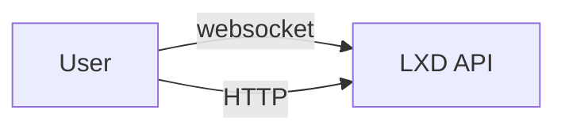
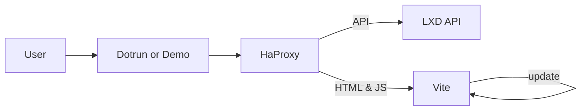
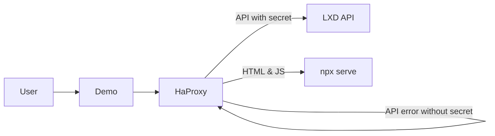
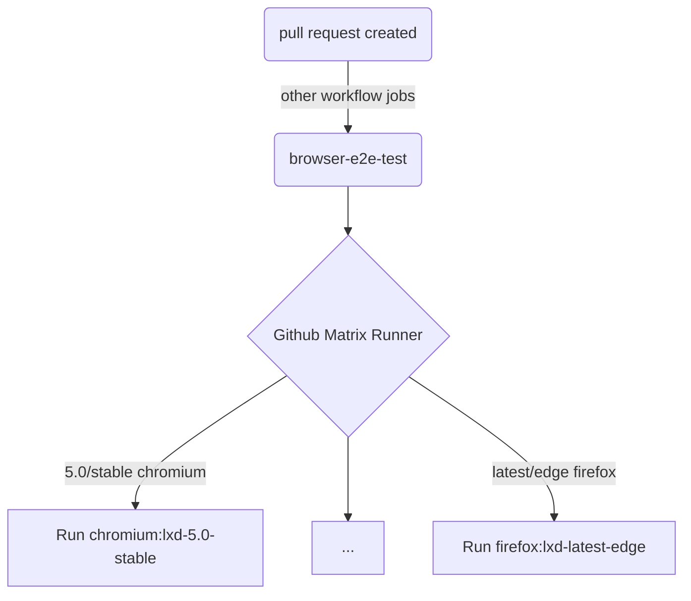

# LXD-UI Architecture

## Production

For the production release, [LXD](https://github.com/canonical/lxd) is pulling the LXD-UI repository and runs the `build` script from [package.json](package.json). This produces static html and javascript into the `build/` directory, which is copied and shipped with LXD. LXD is serving this when a browser is requesting the REST API of LXD.

In a clustered LXD environment the LXD-UI is available on all nodes, so you can query it from any cluster member. Authentication is shared between all nodes.

## Dev setup

For development, dotrun is launching the `start` script from [package.json](package.json) inside a docker container. The dotrun container is running Vite and HaProxy, while the LXD API is outside.

HaProxy is configured and launched from the [entrypoint](entrypoint) script. HaProxy is forwarding requests to LXD API or to npx serve depending on the [haproxy-dev.cfg](haproxy-dev.cfg) base config. HaProxy is used to serve both the UI and API requests under the same domain/ip and port, this avoids cross domain requests, just like in production.

Vite is building static html and javascript on the fly from the repository. Vite is launched directly from the `start` script and configured in [vite.config.ts](vite.config.ts).

The LXD API, which HaProxy forwards to can be overriden with an `.env.local` file, containing a line like `LXD_UI_BACKEND_IP=10.202.236.236`. This is handy to quickly switch between different versions of LXD, a [clustered](https://github.com/canonical/lxd-ui/wiki/Setup-local-LXD-cluster), a non-clustered LXD or a backend with [OIDC enabled](https://github.com/canonical/lxd-ui/wiki/Setup-oidc-login).

## Demo server

A webhook triggers a [demo](https://github.com/canonical/demos.haus) build for any opened or updated pull request created by a collaborator of the repository. The build is configured in [Dockerfile](Dockerfile) and produces an image, which is run in the demo k8s cluster. The cluster provides several secrets, which are read from the [site.yaml](konf/site.yaml) file and used in the [entrypoint](entrypoint) script to configure and authenticate HaProxy to use the LXD-API backend running on another host. The base config for HaProy is in [haproxy-demo.cfg](haproxy-demo.cfg).

The [update_demo.yml](.github/workflows/update_demo.yml) workflow updates a branch called `demo` automatically on any merge to main. This keeps at least one demo instance running and always up to date.

A secret is needed to enable HaProxy to forward requests to the LXD API backend. Ask one of the collaborators for the secret.

## E2E test setup for multiple lxd versions

The e2e test suite is run whenever a pull request is created and updated. This is done in the `browser-e2e-test` job from the `PR checks` github [workflow](https://github.com/canonical/lxd-ui/blob/6b574493501264dbac5722b1c2858f4d0020af75/.github/workflows/pr.yaml#L1). The job is run using the github actions matrix strategy so that the same tests can be carried out against different lxd versions and browser types in isolated github runner environments simultaneously. Currently e2e tests are run against the following parameter combinations:

| lxd version  | browser  |
| -----------  | -------- |
| 5.0/stable   | chromium |
| 5.0/stable   | firefox  |
| latest/edge  | chromium |
| latest/edge  | firefox  |

For each parameter combination, a playwright project defined in [playwright.config.ts](https://github.com/canonical/lxd-ui/blob/6b574493501264dbac5722b1c2858f4d0020af75/playwright.config.ts#L1) is selected by name with reference syntax `browser:lxd-version` and executed. The execution flow is depicted in the diagram below:

To add additional lxd versions for e2e testing, add two new projects to [playwright.config.ts](https://github.com/canonical/lxd-ui/blob/6b574493501264dbac5722b1c2858f4d0020af75/playwright.config.ts#L1) for chromium and firefox. Set the `lxdVersion` parameter accordingly. In [pr.yaml](https://github.com/canonical/lxd-ui/blob/6b574493501264dbac5722b1c2858f4d0020af75/.github/workflows/pr.yaml#L1) include the new lxd versions for the `browser-e2e-test` job. Now you can write tests for the new lxd versions specifically.
